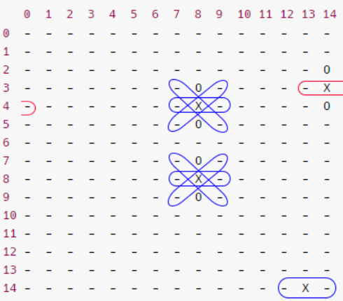

# Rapport algorithme minimax pour Gomoku

*Iman TOURRES, Victor TARROUX, Tom XIE*

## Langage

On a décidé d'implémenter l'algorithme en **C++** car on a appris ce langage au premier semestre et aussi car c'est 400 fois plus rapide que Python.

[Source](https://stackoverflow.com/questions/801657/is-python-faster-and-lighter-than-c)

## Plateau

### Bitboard

L'utilisation d'un plateau de bit (0 ou 1) était peut-être intéressant pour l'implémentation de notre jeu, on a décidé d'essayer pour voir comment on allait s'en sortir avec cette façon de concevoir.

En ayant un plateau $(B_i)_{1 \le i \le 225}$ où $i$ est le bit à la $i$ème case. Chaque joueur aurait son propre bitboard $P_{1i}$ et $P_{2i}$. Ainsi l'opération "ou" des deux plateaux ($\ P_{1i}\  |\  P_{2i}\ $) ferait notre plateau final.

Résumé en code :

```cpp
//game.hpp
#include <bitset>
// 225 car notre plateau fait 15*15
bitset<225> board1; // board du premier joueu
bitset<225> board2; // board du second joueur

//board.hpp
bitset<225> board = board1 | board2;
```

Mais cela allait nous compliquer la tâche au fur et à mesure donc on a décidé de faire simple et d'utiliser une matrice (tableau de tableau)

### Matrice de caractère (char)

On est parti sur une matrice de caractère pour que ça soit plus simple à traiter car l'optimisation du plateau n'était pas important, on peut changer facilement notre plateau, il fallait se focaliser sur l'heuristique.

```cpp
// game.hpp
char **board;

// game.hpp
board = new char[15][15];
```


### Tableau de caractère (version finale)

En ayant fait des recherches sur ce qu'il se faisait dans les compétitions de Gomoku, tout le monde utilisait juste un tableau. C'était logique car l'allocation de la mémoire pour une matrice est plus lourde que juste un simple pointeur de caractère.

La transition d'une matrice vers un tableau n'est pas un gros problème, du coup on a finalement un plateau de caractère pour le traitement des données.

```cpp
// board.hpp
char *board;

// board.hpp
board = new char[225];
```


## Heuristique

### "Pattern" avec Regex

Lorsqu'on transforme la board en une suite de caractère on arrive à retrouver des motifs en particulier, c'est avec ces motifs qu'on peut évaluer un état du plateau.

**Remarque :**

- Motif en ligne : pour regarder les motifs en ligne, on regarde pour chaque ligne (ou tous les 15 caractères) on retrouve le motif (1 ou +).
- En colonne : chaque caractère du motif est espacé de 14 caractères quelconque
- Diagonale \\ : chaque caractère du motif est espacé de 15 caractères quelconque
- Diagonale / : chaque caractère du motif est espacé de 13 caractère quelconque

Exemple avec le motif `.OXO.`: 

```bash
   0  1  2  3  4  5  6  7  8  9  10 11 12 13 14 
0  -  -  -  -  -  -  -  -  -  -  -  -  -  -  -
1  -  -  -  -  -  -  -  -  -  -  -  -  -  -  -
2  -  -  -  -  -  -  -  -  -  -  -  -  -  -  O
3  -  -  -  -  -  -  -  -  O  -  -  -  -  -  X
4  -  -  -  -  -  -  -  -  X  -  -  -  -  -  O  
5  -  -  -  -  -  -  -  -  O  -  -  -  -  -  -
6  -  -  -  -  -  -  -  -  -  -  -  -  -  -  -  
7  -  -  -  -  -  -  -  -  O  -  -  -  -  -  -
8  -  -  -  -  -  -  -  -  X  -  -  -  -  -  -  
9  -  -  -  -  -  -  -  -  O  -  -  -  -  -  -
10 -  -  -  -  -  -  -  -  -  -  -  -  -  -  -  
11 -  -  -  -  -  -  -  -  -  -  -  -  -  -  -
12 -  -  -  -  -  -  -  -  -  -  -  -  -  -  -  
13 -  -  -  -  -  -  -  -  -  -  -  -  -  -  -
14 -  -  -  -  -  -  -  -  -  -  -  -  -  X  -

# getBoard(board);
# output :
--------------------------------------------O--------O-----X--------X-----O--------O-----------------------------O--------------X--------------O-------------------------------------------------------------------------------X-

# countMatch("-X-");
# output :
7
```

On retrouve le motif 7 fois :



En **bleu** les motifs corrects, en **rouge** le faux positif.

Avec son regex associé (pour la colonne) on arrive facilement à retrouver ces motifs`(?=(-.{14}X.{14}-)+)`

**Contrainte :**

- Prendre en compte les faux motifs

**Solution :**

- Utiliser l'itérateur de `regex` sans s'arrêter à la première occurence.

Le problème en testant notre I.A., c'est qu'il prenait beaucoup trop de temps pour évaluer le plateau, on le comprend avec l'utilisation de regex, il fallait convertir et comprendre le regex passé et l'appliquer tout en extrayant la sous chaîne pendant l'itération.

### Adjacent

Une autre heuristique pour éviter de parcourir tout le plateau était de "voir" ce qu'il se passait dans les pions autours de celui qui venait d'être joué. On allait voir ce qu'il se passait tout autour à une distance de 1.

Exemple de plateau :

```
   0  1  2  3  4  5  6  7  8  9  10 11 12 13 14 
0  -  -  -  -  -  -  -  -  -  -  -  -  -  -  -
1  -  -  -  -  -  -  -  -  -  -  -  -  -  -  -
2  -  -  -  -  -  -  -  -  -  -  -  -  -  -  -
3  -  -  -  -  -  -  -  -  O  -  -  -  -  -  -
4  -  -  -  -  -  -  -  X  X  O  -  -  -  -  -  
5  -  -  -  -  -  -  O  O  O  X  -  -  -  -  -
6  -  -  -  -  -  -  -  X  O  -  -  -  -  -  -  
7  -  -  -  -  -  -  -  X  O  X  -  -  -  -  -
8  -  -  -  -  -  -  -  X  X  -  -  -  -  -  -  
9  -  -  -  -  -  -  -  -  -  -  -  -  -  -  -
10 -  -  -  -  -  -  -  -  -  -  -  -  -  -  -  
11 -  -  -  -  -  -  -  -  -  -  -  -  -  -  -
12 -  -  -  -  -  -  -  -  -  -  -  -  -  -  -  
13 -  -  -  -  -  -  -  -  -  -  -  -  -  -  -
14 -  -  -  -  -  -  -  -  -  -  -  -  -  -  -
```

La fonction `adjacent(8,7)` va regarder autour d'elle et appliquer l'algorithme minimax de 1 profondeur pour retourner le coup à jouer.


## Deuxieme heuristique

### Ideation

Nous avons constaté que notre première heuristique prenait trop de temps par rapport au 5s imposées par le sujet. Malgrè l'iterative deepening, chaque tours prenait plus d'une minute de calcule. Nous avons decidé de le modifer en s'inspirant d'heuristique trouvés sur internet:

- [reference github](https://github.com/yunzhu-li/blupig-gomoku)
- [lien 2]()
- [lien 3]()

Nous nous sommes donc tournés vers une methode à la fois efficace en terme de temps mais surtout en terme de score.  

### Representation motif

La reprensation est sous la forme {$p_1$,$p_2$,$p_3$,$p_4$} avec pour signification où $p_i$ est le paramètre $i$:

- $p_1$ : Le nombre minimum d'occurence du motif. Par exemple si $p_1 = 2$ alors le motif doit se retrouver:
  
  - Dans la ligne et dans la diagonale
  
  - Dans la ligne et dans la colonne
  
  - Dans les deux diagonales
  
  - ...

- $p_2$ : Le nombre d'occurence de notre signe. La pièce du joueur doit apparaitre $x$ fois dans le compte.

- $p_3$ : Le nombre de blocage sur les extremités. Si c'est égale à deux alors le joueur est bloqué des deux cotés soit par le joueur adverse soit par la limite du plateau **(-1 signifit que l'algorithme ne prends pas en compte cette argument)**.

- $p_4$ : Le nombre de saut. Cela permet de savoir si le motif tolère un espace dans l'alignement des pieces du joueur **(-1 signifit que l'algorithme ne prends pas en compte cette argument)**.

La methode choisi ne recherche pas des motifs sur seulement une dimension mais aussi sur deux.

---

***10 000 points***

---

| #   | 1   | 2   | 3   | 4   | 5   | 6   | 7   |
|:---:|:---:|:---:|:---:|:---:|:---:|:---:|:---:|
| A   | .   | .   | .   | .   | .   | .   | .   |
| B   | .   | X   | X   | X   | X   | X   | .   |
| C   | .   | .   | .   | .   | .   | .   | .   |

***Représentation {1, 5, 0, 0}, {0, 0, 0, 0}***

---

***700 points*** 

----

| 1 | 2 | 3 | 4 | 5 | 6 | 7 | 8 |
|---|---|---|---|---|---|---|---|
| A | . | O | . | . | . | . | . | 
| B | O | X | X | X | X | . | . | 
| C | . | X | . | . | . | . | . | 
| D | . | X | . | . | . | . | . | 
| E | . | X | . | . | . | . | . | 
| F | . | . | . | . | . | . | . | 

***Représentation {2, 4,  1,  0}, {0, 0,  0,  0}***

----

Liste des motifs associés à leur score :

```c++
{
    {1, 5,  0,  0}, {0, 0,  0,  0},  // 10000
    {1, 4,  0,  0}, {0, 0,  0,  0},  // 700
    {2, 4,  1,  0}, {0, 0,  0,  0},  // 700
    {2, 4, -1,  1}, {0, 0,  0,  0},  // 700
    {1, 4,  1,  0}, {1, 4, -1,  1},  // 700
    {1, 4,  1,  0}, {1, 3,  0, -1},  // 500
    {1, 4, -1,  1}, {1, 3,  0, -1},  // 500
    {2, 3,  0, -1}, {0, 0,  0,  0},  // 300
    {3, 2,  0, -1}, {0, 0,  0,  0},  // 50
    {1, 3,  0, -1}, {0, 0,  0,  0},  // 20
    {1, 2,  0, -1}, {0, 0,  0,  0}   // 9
};
```

### Recherche

Pour trouver les motifs, l'algorithme va parcourir toute la board de cette facon:

1. Instantier un tableau$^{(1)}$ de taille 4, une pour chaque directions :
   
   - Diagonale \
   
   - Diagonale /
   
   - Ligne
   
   - Colonne

2. On parcoure chaque points deux fois:
   
   - Une fois en autorisant un espace dans la recherche
   
   - Une fois sans autoriser d'espaces dans la recherche

Pour chaque parcours l'algorithme regarde dans toutes les direction, dans les deux sens à partir du point. Cela rempli ainsi la partie du tableau dediée à la direction prise.

$^{(1)}$Ce tableau contient la structure suivante : `{n, b, s}`

- `n` : nombre d'occurence du signe

- `b` : nombre de blocage

- `s` : nombre de saut

### Comparaison

Pour la comparaison, on va comparer le tableau de la recherche au tableau du motif. En effet, la representation des motifs est constitué par deux tableau :

- `{A,B,C,D}, {D,E,F,G}`

Cela autorise un motifs à deux dimension, avec le premier stocké dans `{A,B,C,D}`
et le deuxieme dans `{D,E,F,G}`. Lorsque le motif se répète identiquement D,E,F,G sont nuls et `A = 2`. en effet `A` représente le nombre d'occurence minimum.

Si le motif est à seulement une dimension : D,E,F,G sont nuls et `A = 1`. Cependant certains patmotifoivent se repeter trois fois d'ou `A = 3`.

### Exemple

Voici le plateau à évaluer :

| #   | 1   | 2   | 3   | 4   | 5   | 6   | 7   |
|:---:|:---:|:---:|:---:|:---:|:---:|:---:|:---:|
| A   | X   | O   | .   | .   | .   | .   | .   |
| B   | O   | X   | X   | X   | X   | .   | .   |
| C   | .   | X   | O   | O   | .   | .   | .   |
| D   | .   | .   | O   | O   | .   | .   | .   |
| E   | .   | X   | O   | O   | .   | .   | .   |
| F   | .   | X   | .   | .   | .   | .   | .   |
| G   | .   | .   | .   | .   | .   | .   | .   |

lorsque l'algorithme va arriver sur le point `(B,2)` il retournera le tableau suivant

`[{4,1,0}, {4,1,1}, {1,0,0}, {2,2,0}]`

Car il y a repectivement:

- Dans la ligne : 4 pions, 0 espaces et 1 blocage
- Dans la colonne : 4 pions, 1 espace et 1 blocage
- Dans la diagonale / : 1 pion, 0 espace et 0 blocage
- Dans la diagonale \ : 2 pions, 0 espace et 2 blocages

Mainteneant essayons de comparer ce tableau avec ces motifs:

`{1, 4, 1, 0}, {1, 4, -1, 1}`

On retouve 1 fois dans les 4 direction le premier motif et 1 fois dans les 4 directions le deuxieme: le score augmente avec le score assigné.

`{2, 4, 1, 0}, {0, 0, 0, 0}`

On retrouve 1 fois le premier motif. Cependant on remarque que le nombre d'occurence minimum est de 2. Les points ne sont pas assignés.

### Iterative deepening

Afin d'etre certain de respecter les 5 secondes imposées mais aussi de pouvoir aller le plus loin possible dans la fonction MinMax nous avons rajouté l'iterative deepening. Le principe est de calculer à la profondeur 1 puis 2 puis 3,... Et si l'algorithme ne depasse le temps imposé, il continura encore à la profondeur suivante.

Ce systeme est contre-intuitif. En effet cela impose a l'algorithme plus de calcule. Cependant la couche `n+1` necessite plus de temps que toute les couche `i<n` car le temps de calcule est expodentielle. De faite ce systeme permet d'etre sur que l'algorithme atteind la couche la plus profonde possible dans les 5s imposées.
